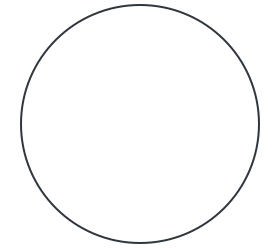
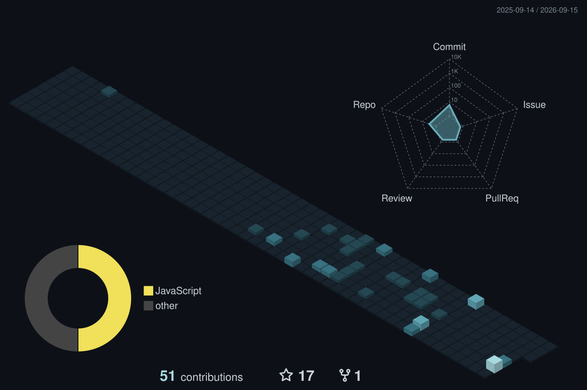

## Hi, I'm xinxiangshicheng / 心想事成 👋

Electronic Information Engineering · Embedded Systems 
PCB Design &amp; Mechanical Design · Homelab &amp; Self-hosting 
Deep Learning · Reinforcement Learning · Heterogeneous Inference 

🎵 **Hatsune Miku · 洛天依** — 华风夏韵，洛水天依 
💜 **Neuro-sama &amp; Evil Neuro** · The Swarm 
🎮 **Minecraft &amp; Stardew Valley &amp; Steam** 
🎧 **神のまにまに &amp; 勾指起誓**

<!-- 联系方式占位：将下面对应的 img 行替换为带链接的徽章，填写自己的邮箱或主页地址。
Email example: 
QQ/Bilibili: use the same badge format with your account name and profile URL. TODO badges intentionally have no links.
-->
 

<!-- 
 先注掉先不放:) -->
 

## 💻 Software & AI

- **Heterogeneous MoE Inference Runtime** [WIP] — Implemented end-to-end CPU/GPU inference across all 32 layers of Phi-tiny-MoE, with 512 experts stored in pinned host memory, GPU expert caching, and speculative prefetching. Validated a 4,080-token chunked prefill followed by 16 decode steps, reaching a logical KV length of 4,096 tokens; peak VRAM during prefill was **3.421 GiB** on an 8 GiB RTX 5060 Laptop GPU. Next: quantized expert storage and on-demand loading for Qwen3-30B-A3B.Ultimate goal: enable cost-effective serving of ultra-large frontier models (e.g., Kimi, GLM) on accessible server-grade hardware.
- **Smart Car Control & Navigation** [Private] — Designed the vehicle's software architecture and state machine for the smart car competition. Prototyped A* path planning for a Mecanum-wheel chassis in Python, then rewrote it entirely in C and deployed it to the microcontroller for real-time navigation.
- **Sokoban Simulation & RL** [Private] — Built custom Sokoban simulation environments using Gymnasium, Pygame, and Isaac Sim, together with a random map generator. Developed a PyTorch reinforcement learning pipeline to explore puzzle solving and long-horizon planning in complex grid environments.
- **[WearBili player](https://github.com/xinxiangshiicheng/xinxiangshicheng_wearbili_player)** — An open-source smartwatch video player using Android MediaPlayer.
- **[API relay](https://github.com/xinxiangshiicheng/apiconversation_xinxiangshicheng)** — An API relay for 小抬腕.
- **Homelab & Minecraft** — Running self-hosted services, a NAS, local language models, and modded Minecraft servers.

## 🔧 Hardware

- **SMB storage switching board** [WIP] — Designed a CH32-based board with a 100 Mbps Ethernet PHY and dual A/B storage, enabling remote file transfer over SMB and seamless switching of the storage mounted by an industrial printing machine.
- **Color matching light booth** [WIP] — Redesigned the sheet metal enclosure and circuitry to maintain **2,000 ± 250 lux** across the viewing surface and block ambient light. The cost per light tube was roughly half that of comparable products.
- **E-paper clock / watch** [Code not public] — Designed and built an e-paper clock with custom C++ drivers over SPI, SD card support, bitmap fonts, and text and image rendering. Adapted GxEPD for unsupported panels and integrated LVGL interfaces.
- **Printing equipment electronics** [Code not public] — Reverse-engineered communication boards and designed replacement console panels for Heidelberg presses, plus serial interface boards connecting printing machines to PCs.

## 🧩 Technology Stack

CH32 · TC264 · LVGL · Gymnasium · Pygame

## 🛠️ Developer Tools

PCB Design · Soldering

## 📊 GitHub Activity

Calendar includes anonymous private contributions. Repository, language and radar statistics cover public activity.

---

Banner illustration generated with AI . / 顶部插画由 AI 生成。
